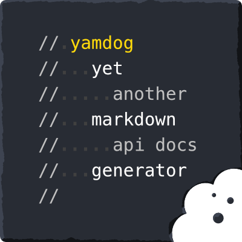

# yamdog

Yet another documentation generator for JavaScript modules. Generate your interface reference documents, API docs, for your code in a fun way. Yamdog's minimal syntax is based on [Markdown](https://en.wikipedia.org/wiki/Markdown) and [YAML](https://yaml.org/) and keeps your comments readable and your code pretty. Yamdog crawls through your ECMAScript projects structured in [CommonJS](https://www.commonjs.org/) or [ESM](https://nodejs.org/api/esm.html) module format. It follows relative require and import statements and scrapes earmarked comment blocks for plain text, Markdown, and YAML. Then it renders the blocks together, spices them up with tables of contents and other happiness, and finally outputs a Markdown document.

[Install](#install) - [Syntax](#syntax) - [Usage](#usage) - [API Docs](https://axelpale.github.io/yamdog/api) - [Contribute](#contribute) - [GitHub](https://github.com/axelpale/yamdog)

> Ya m'dog, I herd you like docs so we wrote docs for our docs generator so you can read docs while u generate yo docs.

## Install

Via [npm](https://www.npmjs.com/package/yamdog) or [yarn](https://yarnpkg.com/en/package/yamdog):

    $ npm install --save-dev yamdog
    $ yarn add --dev yamdog

## Example

Here is a function documented in Yamdog syntax:

    exports.myfun = (foo, options) => {
      // @mylib.myfun(foo, [options])
      //
      // My function with some general documentation at
      // the beginning.
      //
      // Parameters:
      //   foo
      //     string that does something.
      //   options
      //     optional object with properties:
      //     - bar
      //         optional string. Default 'barval'.
      //     - baz
      //         optional number that does a thing and
      //         ..then some more. Default 'bazval'.
      //
      // Return:
      //   integer
      //
      // Some included remarks.
      /// Some excluded remarks.
      //

      // This comment is excluded due to the empty line
      ...
    }

The code above is converted to markdown:

    ## mylib.myfun(foo, \[options\])

    My function with some general documentation at the beginning.

    **Parameters:**
    - *foo*
      - string that does something.
    - *options*
      - optional object with properties:
        - *bar*
          - optional string. Default 'barval'.
        - *baz*
          - optional number that does a thing and then some more. Default 'bazval'.

    **Return:** integer

    Some included remarks.

The markdown above renders to:

> ## mylib.myfun(foo, \[options\])
>
> My function with some general documentation at the beginning.
>
> **Parameters:**
> - *foo*
>   - string that does something.
> - *options*
>   - optional object with properties:
>     - *bar*
>       - optional string. Default 'barval'.
>     - *baz*
>       - optional number that does a thing and then some more. Default 'bazval'.
>
> **Return:** integer
>
> Some included remarks.

## Syntax

A *comment block* is a set of adjacent lines of `//` comments.

    // A comment block
    // that has some text
    some = code

To *earmark* a comment block to be included in your docs, begin the block with an earmark string, being `@` by default. The rest of the line define the *name* of the block and may present how to access or call the documented feature. For example, the name of this block is `doghouse.toys.fetch` and the call signature `(toyname)`:

    // @doghouse.toys.fetch(toyname)
    // This comment block will be included
    // to the docs with a name "doghouse.toys.fetch"
    // and with a heading "doghouse.toys.fetch(toyname)".
    some = code

A block can have *multiple names*. This way you can document aliases for features. Use [aliases decorator](https://axelpale.github.io/yamdog/api#yamdogdecoratorsaliases) to list these alternative names in the docs output.

    // @doghouse.toys.fetch
    // @doghouse.toys.get
    // This block has two names. The first one is the primary one.
    some = code

To make the names stand out in your code, you can use alternative earmarks, for example `###`. The choice is purely optional and have no effect in the docs output.

    // ### doghouse.toys.fetch
    // This block has a prefixed name
    // that is easy to spot in the code.

To skip a line in a block, use triple slash `///`.

    // @doghouse.toys.fetch
    // This line of text is visible in docs.
    /// This line of text is not in docs.
    some = code

To skip the whole block, use triple slash on the earmark line.

    /// @doghouse.toys.legacy
    // This block will not be present in the docs.
    some = code

Indent with space `' '` or dash `'-'` to create lists. You can use any indentation size you like, for example four spaces instead of two.

    // @doghouse.walkTo(x, y)
    //
    // Parameters
    //   x
    //     first sublist item
    //     second sublist item
    //     - sub-sublist item with a dash
    //   y
    //     a number. A distance from the door.
    //

To write multi-line list items, prefix each new line with a double or triple dot `..`. Otherwise the new line becomes a new list item.

    // @doghouse.foods
    //
    // list title
    //   first list item
    //   second list item that spans
    //   .. multiple lines of text like
    //   .. no tomorrow
    //   third list item

*Use triple slash `///` to exclude a line in an earmarked comment block.*

## Usage

To integrate yamdog to your coding project, create a file `docs/generate.js` or similar. The file is the generator program for your document and a way for you to configure the structure and content.

    const yamdog = require('yamdog')
    const path = require('path')
    yamdog.generate({
      // Where to start collecting comment blocks
      entry: path.resolve(__dirname, '../'),
      // Where to generate
      output: path.resolve(__dirname, 'API.md'),
      // Earmark; include comment blocks that begin with this string
      earmark: '@',
      // Main title of the document
      title: 'Doghouse API Documentation',
      // Introduction; the initial paragraph
      intro: 'Welcome to Doghouse API documentation.',
      // Decorators; a customizable features to pimp yo docs
      decorators: [
        yamdog.decorators.alphabetical(), // render in alphabetical order
        yamdog.decorators.toc() // insert tables of contents
      ]
    })

After creating the generator, run it with Node. It will scrape your code and output a document.

    $ node docs/generate.js

Depending on your `output` path, you can now find the freshly baked docs at `docs/API.md`.

    $ cat docs/API.md
    # Doghouse API Documentation
    ...

Integrate the docs generation into your `$ npm run` workflow by adding the following script to your package.json. To integrate with Gulp, Grunt, Webpack etc. use the [JS API](https://axelpale.github.io/yamdog/api).

    scripts: {
      ...
      "build:docs": "node docs/generate.js",
      ...
    }

Naturally you can choose any directory and file names you like. Some prefer `docs/`, others `doc/`, and some even the project root. Suit to your purpose.

See [API documentation](https://axelpale.github.io/yamdog/api) for details, generated with yamdog itself, of course.

## Contribute

Pull requests and [bug reports](https://github.com/axelpale/yamdog/issues) via [GitHub](https://github.com/axelpale/yamdog) are highly appreciated. Please test your contribution with the following scripts:

Run code linter:

    $ npm run lint

Test generate Yamdog's docs:

    $ npm run build:docs

## See also

Yamdog is not the only dog in the block. There are other awesome documentation tools out there that might fit your household better, including:

- [JSDoc](https://jsdoc.app/) - The biggest and baddest of the pack.
- [Dox](https://github.com/tj/dox) - Comment parser that combines JSDoc and Markdown.
- [Markdox](https://github.com/cbou/markdox) - Document generator using the Dox parser.
- [Docco](https://github.com/jashkenas/docco) - Docs with the source code literally included.

## Versioning

We use [Semantic Versioning 2.0.0](http://semver.org/)

## License

[MIT](LICENSE)
