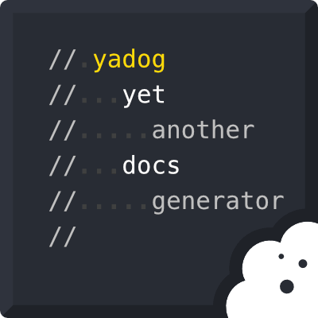

# yadog

Yet another [API](https://en.wikipedia.org/wiki/API) documentation generator for JavaScript. Minimal, indentation-based syntax that keeps your comments readable. Yadog reads your ECMAScript projects structured in [CommonJS](https://www.commonjs.org/) or [ESM](https://nodejs.org/api/esm.html) module format. It follows relative require and import statements to crawl through your code. From the code, it scrapes earmarked comment blocks for plain text, [Markdown](https://en.wikipedia.org/wiki/Markdown), and [YAML](https://yaml.org/). Then it renders the blocks together and outputs a Markdown document.

> Ya dog, I herd you like docs so we wrote docs for our docs generator so you can read docs while u generate yo docs.

## Install

Via [npm](https://www.npmjs.com/package/yadog) or [yarn](https://yarnpkg.com/en/package/yadog):

    $ npm install --save-dev yadog
    $ yarn add --dev yadog

## Example

Here is a function documented in Yadog syntax:

    exports.myfun = (foo, options) => {
      // mylib.myfun(foo, [options])
      //
      // My function with some general documentation at
      // the beginning.
      //
      // Parameters:
      //   foo
      //     string that does something.
      //   options
      //     optional object with properties:
      //       bar
      //         optional string. Default 'barval'.
      //       baz
      //         optional number that does a thing and
      //         ..then some more. Default 'bazval'.
      //
      // Return:
      //   integer
      //
      // Some included remarks.
      /// Some excluded remarks.
      //

      // This comment is excluded due to the empty line
      ...
    }

The code above is converted to markdown:

    ## mylib.myfun(foo, \[options\])

    My function with some general documentation at the beginning.

    **Parameters:**
    - *foo*
      - string that does something.
    - *options*
      - optional object with properties:
        - *bar*
          - optional string. Default 'barval'.
        - *baz*
          - optional number that does a thing and then some more. Default 'bazval'.

    **Return:** integer

    Some included remarks.

The markdown above renders to:

> ## mylib.myfun(foo, \[options\])
>
> My function with some general documentation at the beginning.
>
> **Parameters:**
> - *foo*
>   - string that does something.
> - *options*
>   - optional object with properties:
>     - *bar*
>       - optional string. Default 'barval'.
>     - *baz*
>       - optional number that does a thing and then some more. Default 'bazval'.
>
> **Return:** integer
>
> Some included remarks.

## Syntax

- A *comment block* is a set of adjacent lines of `//` comments.
- To *earmark* a comment block to be included to your docs, begin the block with a line that contains `// name.of.my.module`. The earmark line also presents how to access and call the documented feature.
- To exclude a line in an earmarked comment block, use triple slash `///`.
- Indent with space `' '` or dash `'-'` to create lists.
- To write multi-line list items, prefix each new line with a double or triple dot `..`. Otherwise the new line becomes a new list item.

*Use triple slash `///` to exclude a line in an earmarked comment block.*

## Usage

In your project, create a file `docs/generate.js` with contents similar to:

    const yadog = require('yadog')
    const path = require('path')
    yadog.generate({
      // Where to start collecting comment blocks
      entry: path.resolve(__dirname, '../'),
      // Where to generate
      output: path.resolve(__dirname, 'API.md'),
      // Module name; include blocks that begin with this name.
      name: 'mylib',
      // Main title of the document
      title: 'Mylib API Documentation',
      // Introduction; the initial paragraph
      intro: 'Welcome to mylib API documentation.',
    })

Then you can run it with Node and find your freshly baked docs at `docs/API.md`.

    $ node docs/generate.js

Integrate to your `$ npm run` workflow with the script to your package.json:

    scripts: {
      ...
      "build:docs": "node docs/generate.js",
      ...
    }

See [API documentation](API.md) for details. Generated by yadog itself, of course.

## Contribute

Pull requests and [bug reports](https://github.com/axelpale/yadog/issues) are highly appreciated. Please test your contribution with the following scripts:

Run code linter:

    $ npm run lint

Test generate Yadog's docs:

    $ npm run build:docs

## Versioning

We use [Semantic Versioning 2.0.0](http://semver.org/)

## License

[MIT](LICENSE)
